# Hibiscus Cetide

<div align="center">
    <p>
        <a href="README.md">中文</a> | <a href="README_EN.md">English</a>
    </p>
    
    <p>🚀 一个轻量级的 Java 开发辅助框架，专注于提供开发过程中常用的核心功能，帮助开发者快速构建高质量的应用</p>
    <p>💡 零侵入性 | 🔌 即插即用 | 🛠 开箱即用 | 📦 轻量部署</p>
    <p>
        <a href="https://spring.io/projects/spring-boot">
            
        </a>
        <a href="https://www.oracle.com/java/">
            
        </a>
        <a href="https://redis.io/">
            
        </a>
        <a href="https://www.mysql.com/">
            
        </a>
        <a href="https://mybatis.org/">
            
        </a>
        <a href="https://maven.apache.org/">
            
        </a>
    </p>
    <p>
        <a href="https://github.com/heathcetide/hibiscus/stargazers">
            
        </a>
        <a href="https://github.com/heathcetide/hibiscus/network">
            
        </a>
        <a href="https://github.com/heathcetide/hibiscus/issues">
            
        </a>
    </p>
</div>

## maven依赖
```xml
<!-- hibiscus - base -->
<dependency>
   <groupId>io.github.heathcetide</groupId>
   <artifactId>cetide.hibiscus.demo</artifactId>
   <version>1.0.1</version>
</dependency>
```

## ✨ 特性一览

### 🛠️ 代码生成器
- 支持模板修改和自定义
- 一键生成完整 CRUD 代码
- 智能类型映射
- 多种模板引擎支持

### 📊 数据库管理
- 自动分析数据库连接
- 可视化数据操作界面
- 便捷的数据库管理功能
- 支持多种数据库类型

### 📝 Redis 管理
- 自动分析 Redis 连接
- 数据可视化展示
- 支持多种数据类型操作
- 实时监控和统计

### 💾 缓存管理（Hibiscus-Cache）
- 自研高性能缓存组件
- 支持多级缓存策略
- 实时性能监控和统计
- 智能缓存清理机制
- 灵活的配置选项

### ⚙️ 配置管理
- 多环境配置管理
- 版本控制和历史记录
- 实时配置验证
- 支持回滚操作

### 📈 性能监控
- 实时系统监控
- JVM 性能分析
- API 调用统计
- 自动告警通知

### 🖥️ SSH 终端
- 在线 Web 终端
- 多会话管理
- 命令历史记录
- 文件上传下载

### 📡 信号管理（Hibiscus-Signal）
- 自研信号管理组件
- 服务间解耦
- 信号组管理
- 实时信号监控

### 🔒 接口测试
- 自动扫描接口
- 性能压力测试
- 接口文档生成
- 测试报告导出

### 📋 日志可视化
- 实时日志展示
- 智能日志过滤
- 日志压缩存储
- 关键词搜索
- 日志导出功能


## 🌟 演示项目

为了帮助开发者更好地理解和使用 Hibiscus Cetide，我们提供了一个完整的演示项目：

📦 [hibiscus-example](https://github.com/heathcetide/hibiscus-example)

### 功能演示
演示项目包含以下核心功能的完整实现：

1. **代码生成器使用示例**
   - 自定义模板示例
   - CRUD 代码生成
   - 类型映射配置

2. **数据库操作示例**
   - 多数据源配置
   - 基础 CRUD 操作
   - 复杂查询示例

3. **缓存使用示例**
   - Hibiscus-Cache 配置
   - 多级缓存策略
   - 性能监控接入

4. **接口测试示例**
   - 接口定义规范
   - 测试用例编写
   - 性能测试配置

[//]: # (### 在线演示)

[//]: # (🌐 [在线演示地址]&#40;http://demo.hibiscus.example.com&#41;  )

[//]: # (> 演示账号：demo  )

[//]: # (> 演示密码：demo123)

### 本地运行

1. 克隆演示项目
```bash
git clone https://github.com/heathcetide/hibiscus-example
```

2. 配置环境
```yaml
# application.yml
spring:
  datasource:
    url: jdbc:mysql://localhost:3306/hibiscus_demo
    username: root
    password: root
```

3. 运行项目
```bash
mvn spring-boot:run
```

4. 访问地址
- 后台管理：http://localhost:8080/admin
- 接口文档：http://localhost:8080/swagger-ui.html
- 监控面板：http://localhost:8080/monitor

### 示例代码

1. 缓存配置示例
```java
@Configuration
public class CacheConfig {
    @Bean
    public HibiscusCache<String, Object> userCache() {
        return new HibiscusCache.Builder<String, Object>()
                .maxSize(1000)
                .ttl(1, TimeUnit.HOURS)
                .build();
    }
}
```

2. 接口测试示例
```java
@RestController
@RequestMapping("/api/demo")
public class DemoController {
    @GetMapping("/test")
    public Result<String> test() {
        return Result.success("Hello Hibiscus!");
    }
}
```

> 💡 更多示例代码和详细说明请查看演示项目的 [文档](https://github.com/heathcetide/hibiscus-example/wiki)

## 快速开始

### 环境要求
- JDK 8+
- Maven 3.6+
- Redis 5+
- MySQL 5.7+

### 安装步骤

1. 克隆项目
```bash
git clone https://github.com/heathcetide/hibiscus
```

2. 配置框架
```java
@SpringBootApplication(scanBasePackages = {"hibiscus.cetide.app","com.example"})
public class UserServiceApplication {
    public static void main(String[] args) {
        SpringApplication.run(UserServiceApplication.class, args);
    }
} 
```
```yaml
helper:
 api-test:
   enabled: true
   base-path: /api-test
 hibiscus: hibiscus.cetide.app
```
#### 配置完开启项目访问
    1. http://localhost:8080/api/auth/login 登录地址 [默认账号: admin 密码: admin] 
    1. http://localhost:8080/api/hibiscus/code/backstage# 后台地址
    2. http://localhost:8080/api/hibiscus/interface 接口测试地址
    3. http://localhost:8080/api/hibiscus/logs 日志地址

3. 配置数据库
```yaml
# application.yml
spring:
  datasource:
    driver-class-name: com.mysql.cj.jdbc.Driver
    url: jdbc:mysql://localhost:3306/game_db
    username: root
    password: 1234
  redis:
    database: 1
    port: 6379
    host: localhost
    enabled: true
  application:
    name: spring-boot-helper
  profiles:
    active: dev

```
#### 配置完系统将自动扫描数据库配置
#### 将会在http://localhost:8080/code/backstage# 后台地址自动连接

### 缓存配置 - 自研组件Hibiscus - Cache
#### 开发者可使用基于Java代码或者配置文件两种方式进行配置
```yaml
hibiscus:
   helper:
      api-test:
         enabled: true
         base-path: /api-test
      scanPath: hibiscus.cetide.app
   jwt:
      secret: aGliaXNjdXMtY2V0aWRlLXNlY3JldC1rZXktZm9yLWp3dC10b2tlbi1nZW5lcmF0aW9u
      expiration: 86400000  # 24小时，单位：毫秒
   cache:
      instances:
         product_cache:
            max-size: 10000
            ttl: 3600000
            eviction-policy: LRU
            compression-enabled: false
            metrics-enabled: false
         user_cache:
            max-size: 5000
            ttl: 7200000
            eviction-policy: LRU
            compression-enabled: true
            metrics-enabled: true
         config_cache:
            max-size: 1000
            ttl: -1
            eviction-policy: LRU
            compression-enabled: false
            metrics-enabled: true
```
##### 或者使用代码创建实例：
```java
CacheConfig config = new CacheConfig.Builder<String, Object>()
        .maxSize(props.getMaxSize())                          // 最大容量
        .enableMetrics(props.metricsEnabled)                    // 启用指标收集
        .compressionEnabled(props.compressionEnabled)               // 启用压缩
        .asyncWrite(props.asyncWriteEnabled)                       // 启用异步写入
        .defaultTTL(props.ttl, props.timeUnit)          // 设置TTL为1小时
        .evictionPolicy(props.policy)  // 使用LRU淘汰策略
        .performanceMonitorEnabled(true)        // 启用性能监控
        .monitoringWindow(5, TimeUnit.MINUTES)  // 监控窗口为5分钟
        .build();
cacheManager.createCache(name, config);
```


### SSH配置
```yaml
hibiscus:
 ssh:
  connection-timeout: 30000
  channel-timeout: 30000
  strict-host-key-checking: false
  default-terminal-type: xterm
  default-cols: 80
  default-rows: 24
```

## 🎨 界面预览

<table>
    <td>http://localhost:8080/api/hibiscus/auth/login</td>
    <tr>
        <td>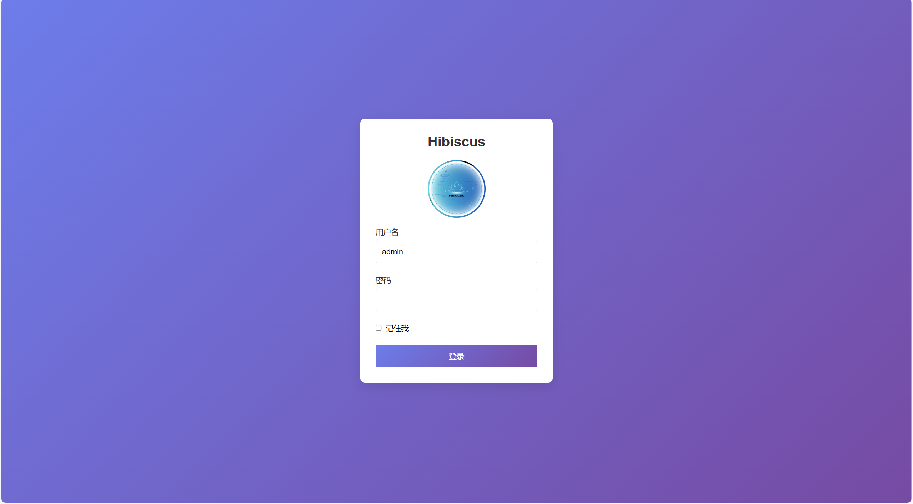登录页面</td>
    </tr>
    <td>http://localhost:8080/api/hibiscus/code/backstage</td>
    <tr>
        <td>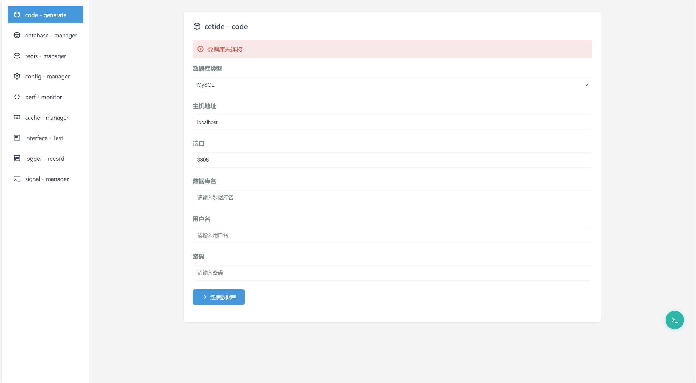代码生成器</td>
    </tr>
    <tr>
        <td>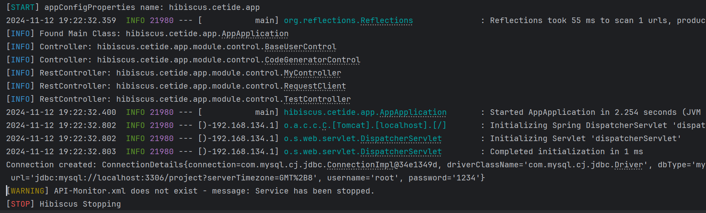数据库管理</td>
    </tr>
    <tr>
        <td>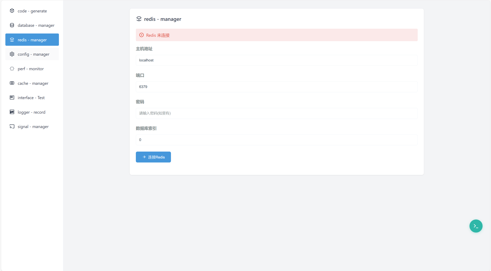Redis管理</td>
    </tr>
    <tr>
        <td>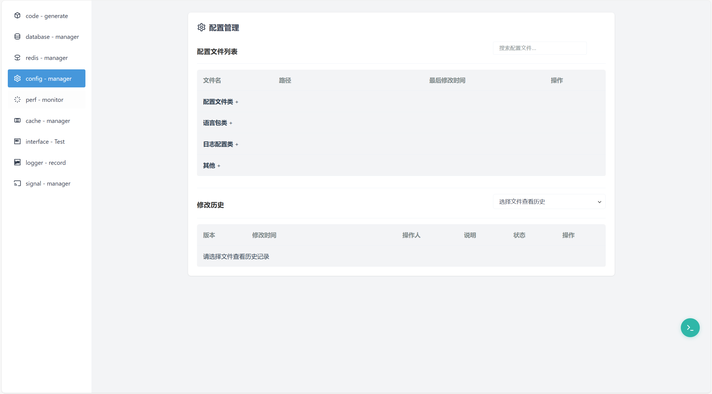配置中心</td>
    </tr>
    <tr>
        <td>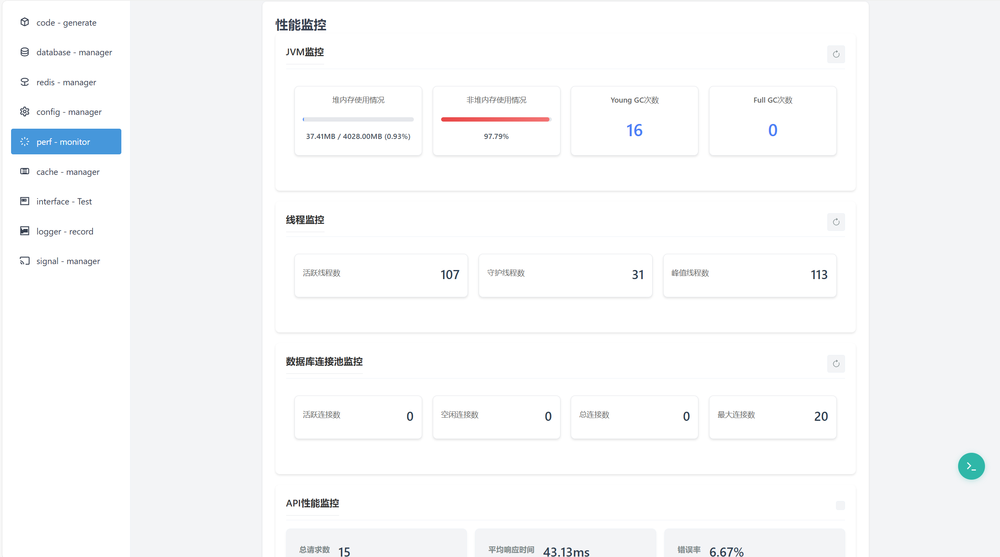性能监控</td>
    </tr>
    <tr>
        <td>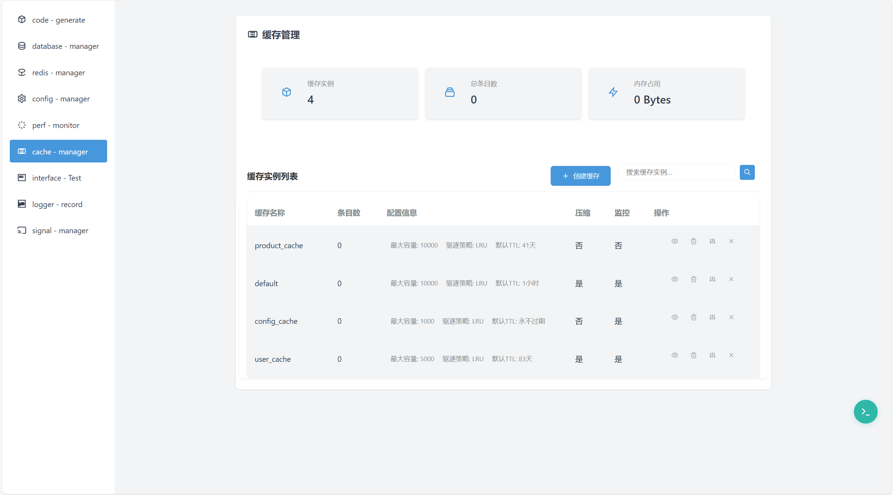缓存中心</td>
    </tr>
    <tr>
        <td>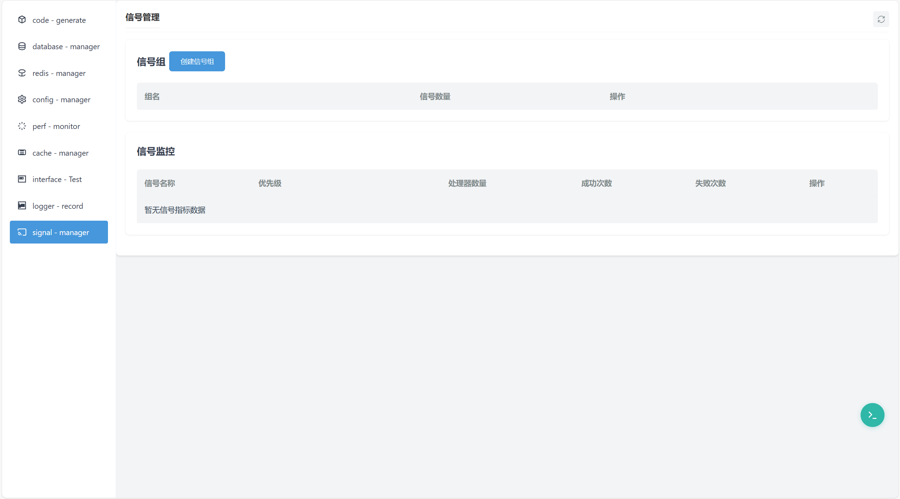信号管理</td>
    </tr>
    <tr>
        <td>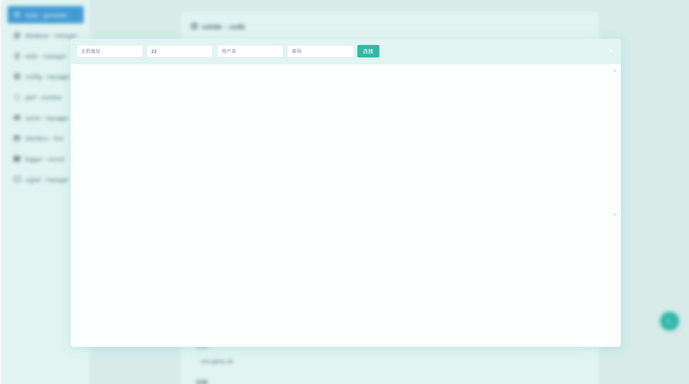终端</td>
    </tr>
    <td>http://localhost:8080/api/hibiscus/interface</td>
    <tr>
        <td>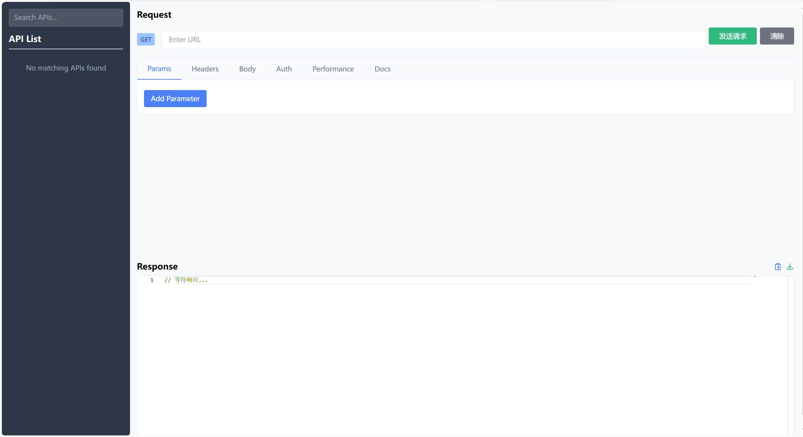API测试</td>
    </tr>
    <td>http://localhost:8080/api/hibiscus/logs</td>
    <tr>
        <td>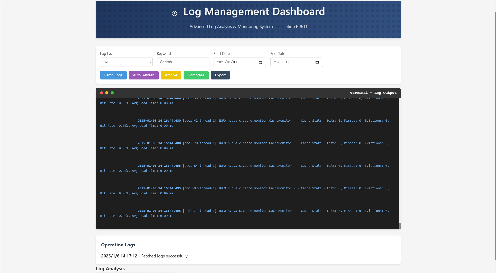日志可视化界面</td>
    </tr>
</table>

## 🤝 贡献者

<a href="https://github.com/heathcetide/hibiscus/graphs/contributors">
    
</a>

## 📄 开源协议

<a href="LICENSE">
    
</a>

## 开发指南

### 添加新功能
1. 在后端创建相应的Controller、Service和Model
2. 在前端添加对应的页面和JavaScript代码
3. 在README中更新API文档

## 常见问题

1. 连接数据库失败
- 检查数据库配置是否正确
- 确保数据库服务正在运行
- 检查网络连接

2. Redis连接失败
- 检查Redis配置是否正确
- 确保Redis服务正在运行
- 检查防火墙设置

3. SSH连接失败
- 检查SSH服务器配置
- 确保有正确的访问权限
- 检查网络连接

## 贡献指南

1. Fork 项目
2. 创建功能分支
3. 提交代码
4. 创建Pull Request

## 版本历史

### v0.2.0 (2024-01-20)
- 初始版本发布
- 基础功能实现

### v0.3.0 (2024-02-01)
- 添加信号管理功能
- 优化性能监控
- 修复已知问题

## 许可证

本项目采用 MIT 许可证 - 详见 [LICENSE](LICENSE) 文件

## 联系方式

- 作者：heath-Cetide
- 邮箱：2148582258@qq.com
- GitHub：https://github.com/heathcetide


## 💬 联系我们
- 📧 邮箱：2148582258@qq.com
- 💬 微信：ct288513832
- 🌐 网站：暂未开放

[//]: # (- https://your-website.com)