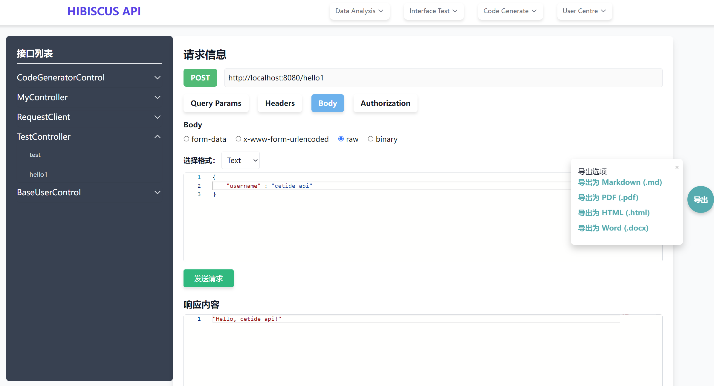
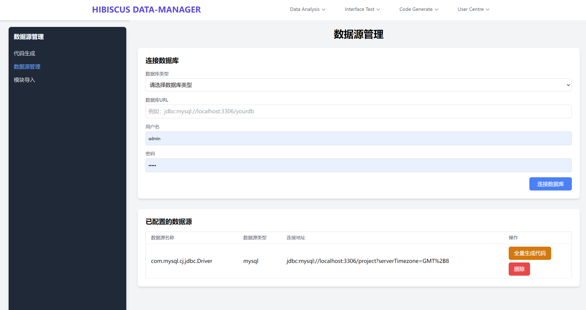
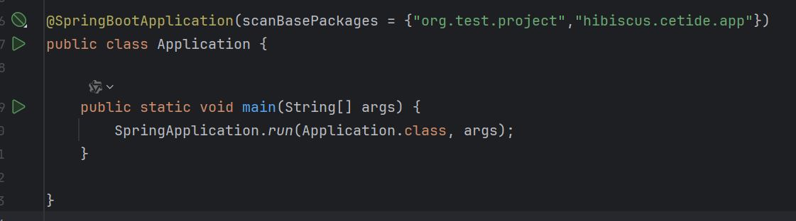

# Hibiscus
<p align="center">
    
    <br>      
    <br>      
    <p align="center">
        Hibiscus是一款非侵入式的Java辅助开发框架，基于主流技术Spring Boot，Hibiscus的核心理念是简化开发的各个步骤，执行全面的接口测试，极大提高开发人员开发效率，降低企业信息化系统的开发成本。
        <br>
        <br>
        <a href="http://spring.io/projects/spring-boot">
            
        </a>
        <a href="https://www.hutool.cn/">
            
        </a>
    </p>
</p>

-----------------------------------------------------------------------------------------------

**Hibiscus** 主要包括以下功能：

- 全面的接口测试
- 接口性能检测和优化
- 自动化代码生成器
- 自动化项目检测
- 初始化数据库模块
- 内置初始模块
- 提供UI界面


## 目录

1. [简介](#简介)
2. [功能](#功能)
3. [安装](#安装)
4. [快速开始](#快速开始)
5. [配置](#配置)
6. [使用方法](#使用方法)

## 简介

Hibiscus旨在解决现代软件开发中的复杂问题。通过将关键工具集成到一个统一的框架中，Hibiscus使开发人员能够专注于构建健壮的应用程序，而不会被重复的任务和配置问题所困扰。

### 核心目标

- **接口测试**：减少设置时间和配置麻烦。
   <!-- 替换为实际的功能图片路径 -->
- **增强测试**：提供强大的接口和API测试工具。
   <!-- 替换为实际的功能图片路径 -->
- **自动化代码生成**：生成样板代码以加速开发。
   <!-- 替换为实际的功能图片路径 -->
- **改进项目检测**：轻松分析和检测项目结构和依赖关系。
   <!-- 替换为实际的功能图片路径 -->

## 功能


Hibiscus提供了一系列功能，以满足现代开发工作流的需求：
- **简化开发流程**
  - 直观的命令行界面（CLI）用于管理项目
  - 与流行开发工具的无缝集成
- **全面的接口测试**
  - 自动化的API测试能力
  - 详细的报告和分析
- **高效的代码生成**
  - 轻松生成模型、控制器和服务
  - 支持多种编程语言
- **高级项目检测**
  - 分析项目依赖和结构
  - 识别潜在问题和优化建议
- **初始化数据库模块**
  - 简化数据库设置和初始化
- **内置初始模块**
  - 提供预配置模块以快速启动
- **用户界面**
  - 用户友好的界面，便于管理和监控

[//]: # (## 安装)

[//]: # ()
[//]: # (![安装步骤]&#40;path/to/installation-image.png&#41; <!-- 替换为实际的安装步骤图片路径 -->)

### 前提条件

在安装Hibiscus之前，请确保你已经安装了以下前提条件：

- **Java** （8.x 或更高版本）
- **Git** 已安装在你的机器上

# 项目依赖

## Maven 依赖

在你的 `pom.xml` 文件中添加以下依赖：
  ```
  <dependency> 
    <groupId>io.github.heathcetide</groupId>
    <artifactId>cetide.hibiscus.demo</artifactId>
    <version>0.2.1</version>
  </dependency>
  ```

## 快速开始


- **SpringBoot的启动类上配置扫描包名**: 
- ```angular2html
  @SpringBootApplication(scanBasePackages = {"com.example.hibiscus","hibiscus.cetide.app"})
  ```
- 
只需配置两个参数即可使用Hibiscus。(分别是是hibiscus.cetide.app和开发者项目的包名)

#### 描述：
1. **hibiscus 本身无侵入性，开发者只需引入依赖和添加启动类的包名，就可以使用Hibiscus**
2. **开发者如果更换技术栈，只需移除hibiscus的依赖，并移除包名，即可。**


## 贡献

我们欢迎社区的贡献。如果你发现bug或有功能请求，请在我们的GitHub仓库中打开一个issue。要贡献代码，请遵循以下步骤：

1. 叉仓库。
2. 创建一个新的分支来实现你的功能或修复bug。
3. 提交你的更改并推送到你的叉仓库。
4. 在主仓库中打开一个拉取请求。