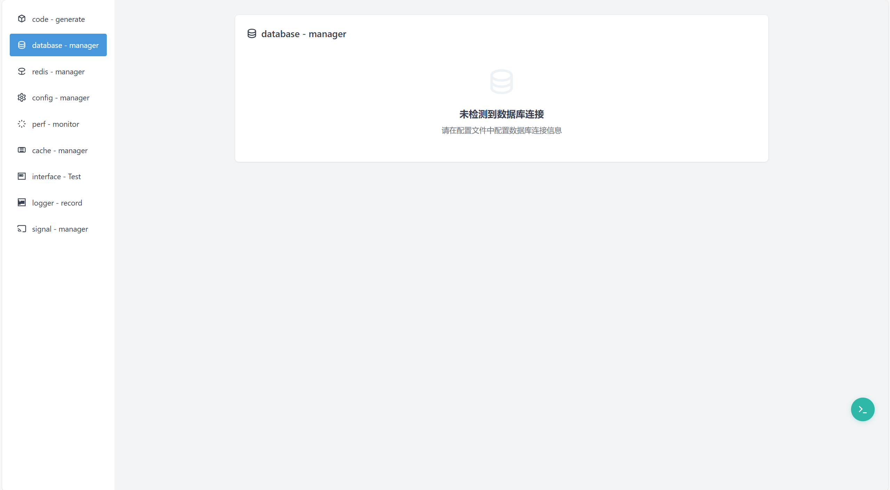
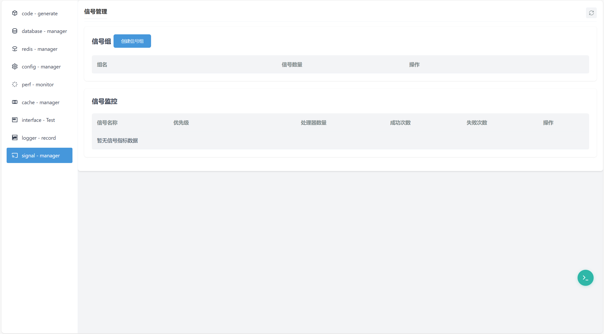
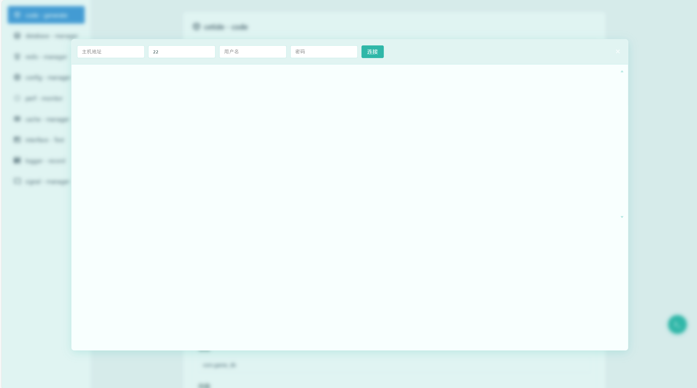
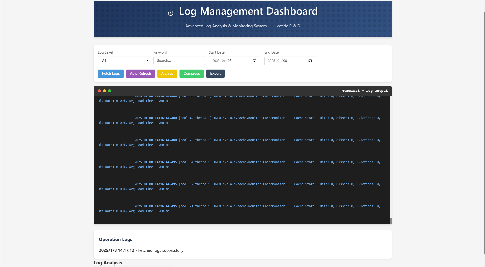

# Hibiscus Cetide

<div align="center">
    <p>
        <a href="README.md">中文</a> | <a href="README_EN.md">English</a>
    </p>
    
    <p>🚀 A lightweight Java development framework that focuses on providing essential features for development process, helping developers quickly build high-quality applications</p>
    <p>💡 Zero Intrusion | 🔌 Plug and Play | 🛠 Out of the Box | 📦 Lightweight Deployment</p>
    <p>
        <a href="https://spring.io/projects/spring-boot">
            
        </a>
        <a href="https://www.oracle.com/java/">
            
        </a>
        <a href="https://redis.io/">
            
        </a>
        <a href="https://www.mysql.com/">
            
        </a>
        <a href="https://mybatis.org/">
            
        </a>
        <a href="https://maven.apache.org/">
            
        </a>
    </p>
    <p>
        <a href="https://github.com/heathcetide/hibiscus/stargazers">
            
        </a>
        <a href="https://github.com/heathcetide/hibiscus/network">
            
        </a>
        <a href="https://github.com/heathcetide/hibiscus/issues">
            
        </a>
    </p>
</div>

## ✨ Features

### 🛠️ Code Generator
- Template modification and customization
- One-click CRUD code generation
- Smart type mapping
- Multiple template engine support

### 📊 Database Management
- Automatic database connection analysis
- Visual data operation interface
- Convenient database management
- Support for multiple database types

### 📝 Redis Management
- Automatic Redis connection analysis
- Data visualization
- Support for multiple data types
- Real-time monitoring and statistics

### 💾 Cache Management (Hibiscus-Cache)
- Self-developed high-performance cache component
- Multi-level cache strategy
- Real-time performance monitoring
- Intelligent cache cleanup
- Flexible configuration options

### ⚙️ Configuration Management
- Multi-environment configuration
- Version control and history
- Real-time configuration validation
- Rollback support

### 📈 Performance Monitoring
- Real-time system monitoring
- JVM performance analysis
- API call statistics
- Automatic alert notification

### 🖥️ SSH Terminal
- Online Web terminal
- Multi-session management
- Command history
- File upload/download

### 📡 Signal Management (Hibiscus-Signal)
- Self-developed signal management component
- Service decoupling
- Signal group management
- Real-time signal monitoring

### 🔒 Interface Testing
- Automatic interface scanning
- Performance stress testing
- Interface documentation generation
- Test report export

### 📋 Log Visualization
- Real-time log display
- Smart log filtering
- Log compression storage
- Keyword search
- Log export functionality

## 🎯 Technology Stack

### Backend
<p>
    
    
    
    
    
    
</p>

### Frontend
<p>
    
    
    
    
    
    
</p>

## 🌟 Demo Project

To help developers better understand and use Hibiscus Cetide, we provide a complete demo project:

📦 [hibiscus-example](https://github.com/heathcetide/hibiscus-example)

### Feature Demonstrations
The demo project includes complete implementations of the following core features:

1. **Code Generator Usage Example**
   - Custom template examples
   - CRUD code generation
   - Type mapping configuration

2. **Database Operation Example**
   - Multi-datasource configuration
   - Basic CRUD operations
   - Complex query examples

3. **Cache Usage Example**
   - Hibiscus-Cache configuration
   - Multi-level cache strategy
   - Performance monitoring integration

4. **Interface Testing Example**
   - Interface definition standards
   - Test case writing
   - Performance test configuration

### Local Setup

1. Clone the demo project
```bash
git clone https://github.com/heathcetide/hibiscus-example
```

2. Configure environment
```yaml
# application.yml
spring:
  datasource:
    url: jdbc:mysql://localhost:3306/hibiscus_demo
    username: root
    password: root
```

3. Run the project
```bash
mvn spring-boot:run
```

4. Access URLs
- Admin Panel: http://localhost:8080/admin
- API Documentation: http://localhost:8080/swagger-ui.html
- Monitoring Dashboard: http://localhost:8080/monitor

### Example Code

1. Cache Configuration Example
```java
@Configuration
public class CacheConfig {
    @Bean
    public HibiscusCache<String, Object> userCache() {
        return new HibiscusCache.Builder<String, Object>()
                .maxSize(1000)
                .ttl(1, TimeUnit.HOURS)
                .build();
    }
}
```

2. Interface Testing Example
```java
@RestController
@RequestMapping("/api/demo")
public class DemoController {
    @GetMapping("/test")
    public Result<String> test() {
        return Result.success("Hello Hibiscus!");
    }
}
```

> 💡 For more example code and detailed documentation, please check the demo project's [wiki](https://github.com/heathcetide/hibiscus-example/wiki)

## Quick Start

### Requirements
- JDK 8+
- Maven 3.6+
- Redis 5+
- MySQL 5.7+

### Installation Steps

1. Clone the project
```bash
git clone https://github.com/heathcetide/hibiscus
```

2. Configure framework
```java
@SpringBootApplication(scanBasePackages = {"hibiscus.cetide.app","com.example"})
public class UserServiceApplication {
    public static void main(String[] args) {
        SpringApplication.run(UserServiceApplication.class, args);
    }
} 
```
```yaml
helper:
 api-test:
   enabled: true
   base-path: /api-test
 hibiscus: hibiscus.cetide.app
```
#### After configuration, access the project at:
    1. http://localhost:8080/api/auth/login Login page [Default account: admin password: admin]
    2. http://localhost:8080/api/hibiscus/code/backstage# Admin panel
    3. http://localhost:8080/api/hibiscus/interface API testing
    4. http://localhost:8080/api/hibiscus/logs Log visualization

3. Configure database
```yaml
# application.yml
spring:
  datasource:
    driver-class-name: com.mysql.cj.jdbc.Driver
    url: jdbc:mysql://localhost:3306/game_db
    username: root
    password: 1234
  redis:
    database: 1
    port: 6379
    host: localhost
    enabled: true
  application:
    name: spring-boot-helper
  profiles:
    active: dev
```

#### The system will automatically scan database configuration
#### It will automatically connect at http://localhost:8080/code/backstage#

### Cache Configuration - Hibiscus-Cache Component
#### Developers can configure using either Java code or configuration files
```yaml
hibiscus:
   helper:
      api-test:
         enabled: true
         base-path: /api-test
      scanPath: hibiscus.cetide.app
   jwt:
      secret: aGliaXNjdXMtY2V0aWRlLXNlY3JldC1rZXktZm9yLWp3dC10b2tlbi1nZW5lcmF0aW9u
      expiration: 86400000  # 24 hours in milliseconds
   cache:
      instances:
         product_cache:
            max-size: 10000
            ttl: 3600000
            eviction-policy: LRU
            compression-enabled: false
            metrics-enabled: false
         user_cache:
            max-size: 5000
            ttl: 7200000
            eviction-policy: LRU
            compression-enabled: true
            metrics-enabled: true
         config_cache:
            max-size: 1000
            ttl: -1
            eviction-policy: LRU
            compression-enabled: false
            metrics-enabled: true
```

##### Or create instances using code:
```java
CacheConfig config = new CacheConfig.Builder<String, Object>()
        .maxSize(props.getMaxSize())                          // Maximum capacity
        .enableMetrics(props.metricsEnabled)                    // Enable metrics collection
        .compressionEnabled(props.compressionEnabled)               // Enable compression
        .asyncWrite(props.asyncWriteEnabled)                       // Enable async write
        .defaultTTL(props.ttl, props.timeUnit)          // Set TTL to 1 hour
        .evictionPolicy(props.policy)  // Use LRU eviction policy
        .performanceMonitorEnabled(true)        // Enable performance monitoring
        .monitoringWindow(5, TimeUnit.MINUTES)  // Set monitoring window to 5 minutes
        .build();
cacheManager.createCache(name, config);
```

### SSH Configuration
```yaml
hibiscus:
 ssh:
  connection-timeout: 30000
  channel-timeout: 30000
  strict-host-key-checking: false
  default-terminal-type: xterm
  default-cols: 80
  default-rows: 24
```

## 🎨 Interface Preview

<table>
    <td>http://localhost:8080/api/hibiscus/auth/login</td>
    <tr>
        <td>Login Page</td>
    </tr>
    <td>http://localhost:8080/api/hibiscus/code/backstage</td>
    <tr>
        <td>Code Generator</td>
    </tr>
    <tr>
        <td>Database Management</td>
    </tr>
    <tr></tr>
        <td>Redis Management</td>
    </tr>
    <tr>
        <td>Configuration Center</td>
    </tr>
    <tr>
        <td>Performance Monitoring</td>
    </tr>
    <tr>
        <td>Cache Center</td>
    </tr>
    <tr>
        <td>Signal Management</td>
    </tr>
    <tr>
        <td>Terminal</td>
    </tr>
    <td>http://localhost:8080/api/hibiscus/interface</td>
    <tr>
        <td>API Testing</td>
    </tr>
    <td>http://localhost:8080/api/hibiscus/logs</td>
    <tr>
        <td>Log Visualization Interface</td>
    </tr>
</table>

## Development Guide

### Adding New Features
1. Create corresponding Controller, Service, and Model in the backend
2. Add corresponding pages and JavaScript code in the frontend
3. Update API documentation in README

## Common Issues

1. Database Connection Failed
- Check if database configuration is correct
- Ensure database service is running
- Check network connection

2. Redis Connection Failed
- Check if Redis configuration is correct
- Ensure Redis service is running
- Check firewall settings

3. SSH Connection Failed
- Check SSH server configuration
- Ensure correct access permissions
- Check network connection

## Contribution Guide

1. Fork the project
2. Create feature branch
3. Submit code
4. Create Pull Request

## Version History

### v0.2.0 (2024-01-20)
- Initial version release
- Basic functionality implementation

### v0.3.0 (2024-02-01)
- Added signal management functionality
- Optimized performance monitoring
- Fixed known issues

## License

This project is licensed under the MIT License - see the [LICENSE](LICENSE) file for details

## Contact

- Author: heath-Cetide
- Email: 2148582258@qq.com
- GitHub: https://github.com/heathcetide

## 💬 Contact Us
- 📧 Email: 2148582258@qq.com
- 💬 WeChat: ct288513832
- 🌐 Website: Coming soon
</rewritten_file> 